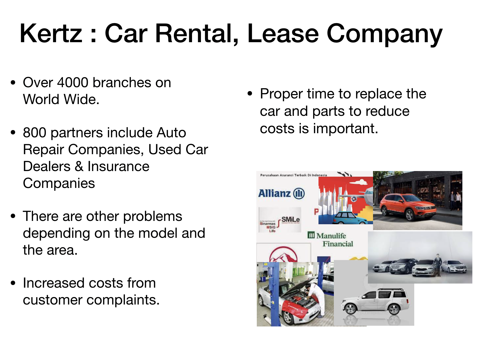
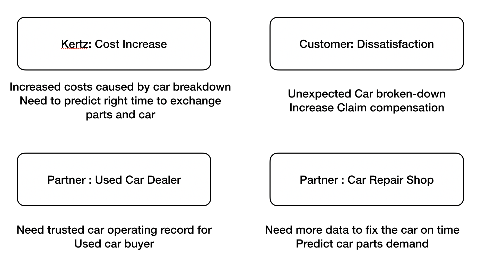
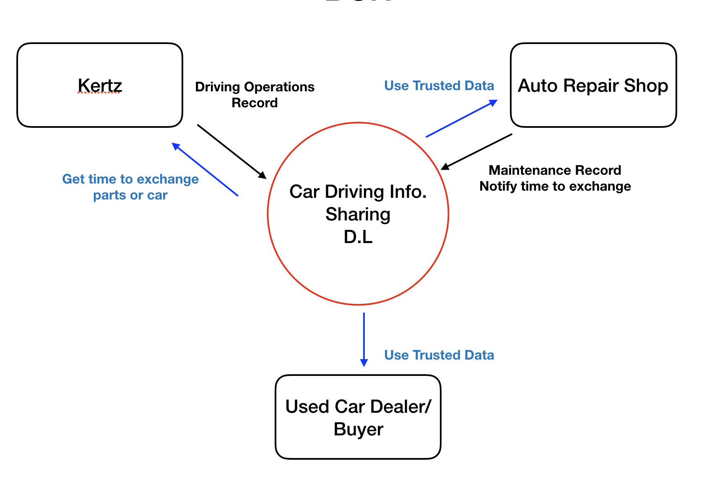

**[Please read!!!] This is only for test & learn Hyperledger fabric & Composor!**

# Senario

Kertz is a car rental company and has more than 4,000 branches worldwide.

There are more than 800 partner companies, including auto repair companies, insurance companies, and used car dealers who sell used cars at the right time.

Consumer dissatisfaction is increasing in many parts of the world due to car breakdowns in various models.
Even with the same car model, it seems that unexpected problems are occurring depending on the region, environment, and driver habits.

In order to analyze this, it is necessary to acquire more data of the car in operation.
Based on the data analyzed through this analysis, we will sell cars with accurate information to used car dealers at the right time.



# Kertz & Partners Agony 



## Participants
| Participants | Issue | Issue |
|---|:---:|:---:|
| `Kertz` | Cost Increase |  |
| `Car Repair Company` | predict accurate parts demand |  |
| `User Car Dealer` | Need trusted Record |  |
| `User Car Buyer` | Need trusted Record | to-be |
| `Insurance` | Need trusted Record |  to-be|
| `Personal Car owner` | Need benefit for Information Providing | to-be |

# Car Operation Information Sharing BCN




# Getting started.

## Prerequisites
Hyperledger fabric
Hyperledger composer


# Models
## Assets


### CarInfo

```
asset CarInfo identified by carinfoId { 
  o String carinfoId 
  o OperatingData OperatingData optional
  o String[] basic_car_info 
  o MaintenanceData mData optional 
  o String[] driver_info optional
  o Status currunt_status default="None" 
} 
```

### Contract

```
asset Contact identified by contractId { 
  o String contractId 

  o String currentStatus 
  o String driverInformation 
  o String insuranceInformation 
  --> CarInfo carinformation optional 
}
```

## Participants

### abstract CarInfoSharingParticipant
```
 abstract participant CarInfoSharingParticipant identified by participantKey {
   o String participantKey
   o Contact contact
    }
```

### participant RentalCompany
```
participant RentalCompany extends CarInfoSharingParticipant {
   
 }
```

### participant CarRepirShop
```
 participant CarRepirShop extends CarInfoSharingParticipant {
   
 }
```
 
### participant UsedCarDealer
```
participant UsedCarDealer extends CarInfoSharingParticipant {
 
 }
 ```
### expand participants
```
Insurance<br>
Usedcar buyer
Pernal Car Owner 
Auto Parts Factory 
```

## Transaction

### CreateContract
```
 transaction CreateContract { 
   o String driverInformation 
   o String insuranceInformation 
   o DateTime contractStartDate 
   o DateTime contractEndDate 
 } 
```
 
### CreateCarOperationData
```
 transaction CreateCarOperationData { 
   o String carinfoId 
   o OperatingData OperatingData 
   o DateTime checkTime 
 } 
```


### CreateMaintenanceData
```
 transaction CreateMaintenanceData { 
   o String carinfoId 
   o MaintenanceData mData 
   o DateTime checkTime <br> 
 }  ]
```
 
 
## References
....

